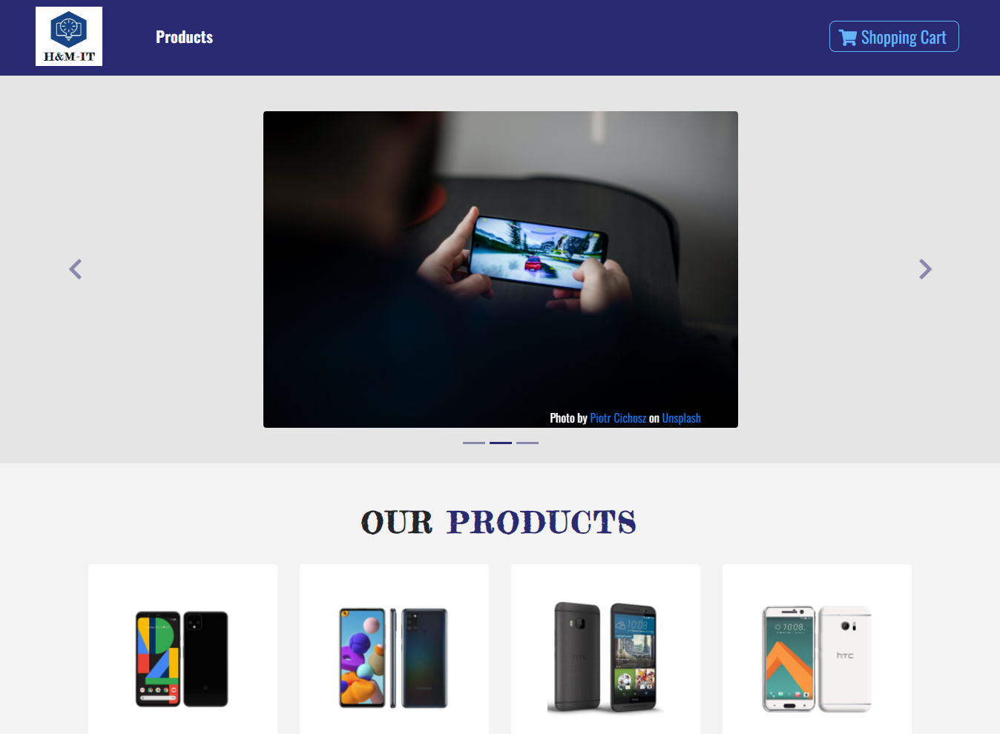

<h1 align="center">
  
</h1>

ESta aplicação é uma simulação de loja on-line com alguns produtos e a funcionalidade de adicionar os itens no carrinho.

Este projeto foi inicializado com o [Create React App](https://github.com/facebook/create-react-app).

Foram utilizadas as tecnologias:

- [react](https://pt-br.reactjs.org/)
- [bootstrap](https://getbootstrap.com/)
- [react-bootstrap](https://react-bootstrap.github.io/)
- [styled-components](https://styled-components.com/)
